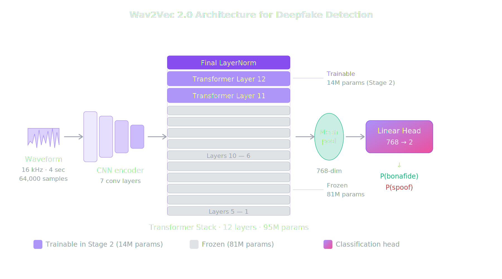
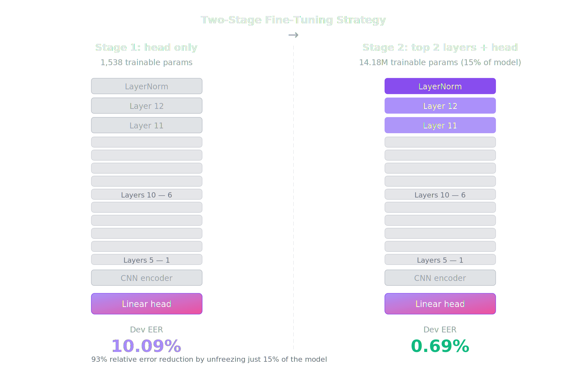

<p align="center">
  
  
  
</p>

<h1 align="center">Deepfake Audio Detection</h1>

<p align="center">
  <strong>AI Voice Cloning Detection via Fine-Tuned Self-Supervised Speech Transformers</strong><br>
  Sara Iqbal & Areeba Arif · FAST-NUCES Spring 2026 · Deep Learning Project
</p>

<p align="center">
  <a href="https://huggingface.co/spaces/Sara1708/deepfake-audio-detector">🎤 Try the Live Demo</a> · 
  <a href="https://huggingface.co/Sara1708/deepfake-audio-wav2vec2">📦 Model Weights</a> · 
  <a href="https://sara1708-deepfake-audio-detector.hf.space/api">🔌 API Endpoint</a> . 
  <a href="https://wandb.ai/sara-jaffrani17-dlp/deepfake-audio-detection/workspace?nw=nwusersarajaffrani17"> 📈 Training Visuals</a>
</p>

---

## What this project does

A deep learning system that detects whether an audio clip contains **real human speech** or **AI-synthesized speech**. Upload any audio file, record from your microphone, or try the built-in examples — the model returns a prediction with calibrated confidence scores.

Built by fine-tuning **Wav2Vec 2.0 Base** (a self-supervised speech transformer pretrained on 960 hours of speech) on the **ASVspoof 2019 LA** benchmark dataset using a two-stage training strategy.

---

## Results at a glance

| Benchmark | EER | What it tests |
|---|---|---|
| **ASVspoof 2019 LA** | **5.55%** | 13 unseen attack types (TTS + voice conversion) |
| **ASVspoof 2021 LA** | **9.09%** | Same attacks through telephone codecs |
| **WaveFake** | **26.33%** | Novel neural vocoder pipelines (MelGAN, HiFi-GAN) |

### Comparison to published baselines

| System | 2019 LA EER | 2021 LA EER |
|---|---|---|
| Official LFCC-GMM baseline | 8.09% | 25.56% |
| Official CQCC-GMM baseline | 9.57% | 19.30% |
| Official LFCC-LCNN baseline | — | 9.26% |
| Official RawNet2 baseline | — | 9.50% |
| **This work (Wav2Vec 2.0)** | **5.55%** | **9.09%** |

Our model outperforms LFCC-GMM on 2019 LA by 2.54 pp and matches the strongest neural baselines on 2021 LA — without any codec-specific training augmentation.

---

## Architecture

<p align="center">
  
</p>

The model takes raw 16 kHz audio, processes it through Wav2Vec 2.0's CNN encoder and 12-layer transformer stack, mean-pools the sequence into a 768-dim embedding, and classifies it through a linear head. Purple layers are trainable in Stage 2; gray layers remain frozen.

### Two-stage fine-tuning

<p align="center">
  
</p>

| Stage | What's trained | Trainable params | Dev EER |
|---|---|---|---|
| **Stage 1** | Linear head only | 1,538 | 10.09% |
| **Stage 2** | Top 2 layers + LayerNorm + head | 14.18M (15% of model) | **0.69%** |

Stage 2 achieves a **93% relative error reduction** over Stage 1 by unfreezing just 15% of the model with a lower learning rate (1e-5) and 10% warmup.

---

## Honest limitations

We tested the model beyond its training domain and are transparent about where it fails:

- **A10 attack blind spot:** A10 uses Tacotron 2 + WaveRNN, producing speech that is acoustically indistinguishable from real speech even to human listeners (confirmed by the ASVspoof 2019 paper). The model classifies A10 samples as authentic with 100% confidence — a fundamental limit of acoustic-feature-based detection.

- **WaveFake cross-corpus gap (26.33% EER):** The model learned ASVspoof-specific synthesis artifacts (TTS + voice conversion) but doesn't generalise to pure neural vocoder attacks (MelGAN, HiFi-GAN, WaveGlow). This is a training data coverage gap, not classical overfitting — the 5.55% on 13 unseen ASVspoof attacks proves the model learned transferable patterns within its training family.

- **Codec sensitivity:** GSM and PSTN telephone codecs degrade EER by ~6 percentage points. Codec augmentation during training would likely close this gap.

- **Not a production security tool.** Real-world deepfakes use synthesis methods this model has never seen. This is a research demonstration, not a deployment-ready detector.

---

## Project structure

```
deepfake-audio-detection/
├── app/
│   ├── app.py                    # Gradio web app (4-tab interface)
│   ├── examples/                 # Example audio clips (easy → hardest)
│   └── src/
│       ├── inference/predict.py  # DeepfakeDetector wrapper class
│       ├── models/               # Wav2Vec2 classifier architecture
│       └── data/                 # Preprocessing utilities
├── assets/
│   ├── architecture.png          # Architecture diagram
│   └── finetuning.png            # Two-stage training diagram
├── notebooks/
│   ├── 01_data_preparation.ipynb
│   ├── 02_stage1_training.ipynb
│   ├── 03_evaluation.ipynb
│   └── 04_deployment.ipynb
├── results/
│   └── scores/                   # Evaluation score arrays
├── requirements.txt
└── README.md
```

---

## Quick start

### Try the live demo

**[https://huggingface.co/spaces/Sara1708/deepfake-audio-detector](https://huggingface.co/spaces/Sara1708/deepfake-audio-detector)**

Upload audio, record from your mic, or click an example. No setup needed.

### Run locally

```bash
git clone https://github.com/Saracasm/deepfake-audio-detection.git
cd deepfake-audio-detection
pip install -r requirements.txt
cd app && python app.py
```

### Use the API

The deployed Gradio app exposes a REST API automatically:

```python
from gradio_client import Client

client = Client("Sara1708/deepfake-audio-detector")
result = client.predict(
    audio="path/to/audio.wav",
    api_name="/predict"
)
print(result)
```

### Use the model directly

```python
from src.inference.predict import DeepfakeDetector

detector = DeepfakeDetector(checkpoint_path="path/to/stage2_best.pt")
result = detector.predict("audio.wav", return_per_window=True)

print(f"Prediction: {result['prediction']}")
print(f"Confidence: {result['confidence']:.2%}")
print(f"Spoof probability: {result['spoof_probability']:.4f}")
```

---

## Datasets

| Dataset | Role | Size | Source |
|---|---|---|---|
| **ASVspoof 2019 LA** | Training + primary eval | 2,580 genuine + 22,800 spoofed (train) | [datashare.ed.ac.uk](https://datashare.ed.ac.uk/handle/10283/3336) |
| **ASVspoof 2021 LA** | Cross-dataset eval | Codec-degraded versions | [ASVspoof.org](https://www.asvspoof.org/) |
| **WaveFake** | Out-of-domain eval | ~117,000 clips from 6 vocoders | [GitHub](https://github.com/RUB-SysSec/WaveFake) |

---

## Key design decisions

| Decision | Rationale |
|---|---|
| **Wav2Vec 2.0 Base** over Large | Sufficient capacity for binary classification; trains on T4 GPU |
| **Two-stage training** | Stage 1 validates the approach (10.09% with 1,538 params); Stage 2 refines it |
| **Class-weighted CE loss** | Handles 9:1 spoof:bonafide imbalance (weights: bonafide=4.92, spoof=0.56) |
| **4-sec windows, 50% overlap** | Consistent input length; mean aggregation over windows for utterance-level prediction |
| **Mixed precision (fp16)** | Reduced training time from ~6h to 2h 56m on T4 |
| **WaveFake evaluation** | Not required by the project — included for honest cross-corpus analysis |

---

## What this project demonstrates

1. **Wav2Vec 2.0 features work for deepfake detection.** Pretrained speech representations carry strong anti-spoofing signal, unlockable with minimal fine-tuning (15% of model parameters). The result matches or beats published neural baselines.

2. **Single-corpus training has measured limits.** The A10 blind spot reveals a fundamental challenge: when synthesis is acoustically indistinguishable from real speech (even to humans), acoustic-feature-based detection reaches its theoretical limit. The WaveFake results show cross-family generalisation requires cross-family training data.

3. **The path forward is clear.** Universal AI voice cloning detection requires multi-corpus, multi-family training — combining ASVspoof, WaveFake, and newer datasets. This project establishes the baseline with measured evidence.

---

## Tech stack

- **Model:** Wav2Vec 2.0 Base (Facebook AI / HuggingFace Transformers)
- **Training:** PyTorch, mixed precision (fp16), Weights & Biases logging
- **App:** Gradio 5.x with custom CSS, inline SVG diagrams
- **Deployment:** HuggingFace Spaces (free CPU tier)
- **Development:** Google Colab (T4 GPU for training)

---

## Citations

```bibtex
@article{wang2020asvspoof,
  title={ASVspoof 2019: A large-scale public database of synthesized, converted and replayed speech},
  author={Wang, Xin and Yamagishi, Junichi and Todisco, Massimiliano and others},
  journal={Computer Speech \& Language},
  year={2020}
}

@article{baevski2020wav2vec,
  title={wav2vec 2.0: A framework for self-supervised learning of speech representations},
  author={Baevski, Alexei and Zhou, Yuhao and Mohamed, Abdelrahman and Auli, Michael},
  journal={NeurIPS},
  year={2020}
}

@inproceedings{frank2021wavefake,
  title={WaveFake: A Data Set to Facilitate Audio Deepfake Detection},
  author={Frank, Joel and Sch{\"o}nherr, Lea},
  booktitle={NeurIPS Datasets and Benchmarks Track},
  year={2021}
}
```

---

<p align="center">
  <strong>Built by</strong> Sara Iqbal & Areeba Arif · FAST-NUCES Spring 2026<br>
  <a href="https://huggingface.co/spaces/Sara1708/deepfake-audio-detector">Live Demo</a> · 
  <a href="https://huggingface.co/Sara1708/deepfake-audio-wav2vec2">Model</a> · 
  <a href="https://sara1708-deepfake-audio-detector.hf.space/api">API</a>
</p>

